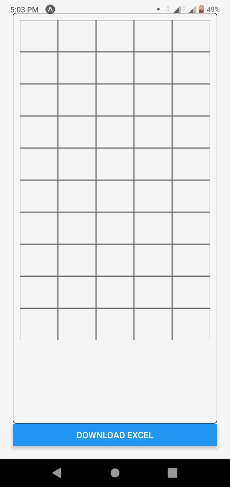
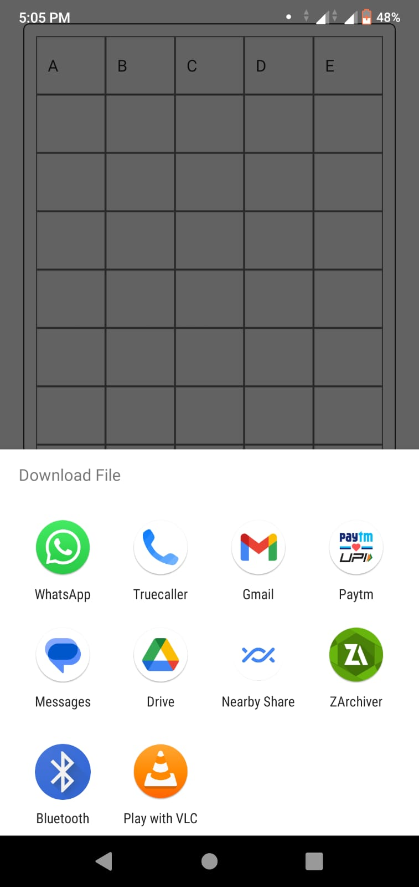

````markdown
# Excel Grid App

A simple React Native app that allows you to create a grid of data, save it, and download it as an Excel file.

## Features

- Create and edit a grid of data.
- Save the grid data to your device using AsyncStorage.
- Download the grid data as an Excel file for offline use.

## Getting Started

To get started with the app, follow these steps:

1. Clone this repository to your local machine:

   ```shell
   git clone <repository-url>
   ```
````

2. Change to the project directory:

   ```shell
   cd excel-grid-app
   ```

3. Install the required dependencies:

   ```shell
   npm install
   ```

4. Start the development server:

   ```shell
   npm start
   ```

5. Scan the QR code displayed in your terminal with the Expo Go app on your mobile device or use an emulator to run the app.

## Usage

1. Use the app to create and edit a grid of data.

2. Your data is automatically saved to your device using AsyncStorage. It will be loaded the next time you open the app.

3. To download the grid data as an Excel file, click the "Download Excel" button. The Excel file will be saved to your device.

## Screenshots

<!-- Add your screenshots here -->




## Contributing

Contributions are welcome! If you'd like to contribute to the project, please follow these steps:

1. Fork the repository.

2. Create a new branch for your feature or bug fix:

   ```shell
   git checkout -b feature/my-feature
   ```

3. Make your changes and commit them:

   ```shell
   git commit -m 'Add my feature'
   ```

4. Push your changes to your fork:

   ```shell
   git push origin feature/my-feature
   ```

5. Create a pull request to the main repository with a description of your changes.

## License

This project is licensed under the MIT License - see the [LICENSE](LICENSE) file for details.

```

Make sure to add your actual screenshots by placing them in a folder called "screenshots" within your project directory and updating the image file paths in the "Screenshots" section.
```
